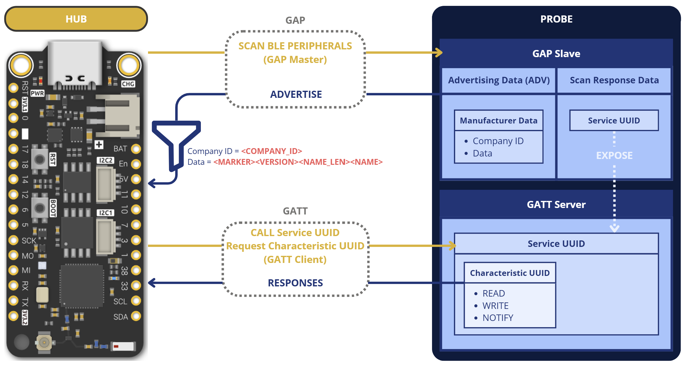

# hub-core

### 1. Commands

````powershell
$env:WIFI_SSID = "YOUR_WIFI"
$env:WIFI_PASSWORD = "YOUR_WIFI_PASSWORD"
````
````
cargo +esp check
````
````
cargo +esp run
````

During `cargo +esp check` / `cargo +esp run`, the build script prints the hub
identity and a ready-to-open setup URI:

```text
warning: probe-grpc@0.1.0: HarvestHub setup hub_uuid=...
warning: probe-grpc@0.1.0: HarvestHub setup hub_secret=...
warning: probe-grpc@0.1.0: HarvestHub setup uri=harvesthub://hub-setup?hub_uuid=...&hub_secret=...&hub_name=HarvestHub-Dev
```

The generated identity is stored at `target/harvesthub-dev-identity.env` and is
embedded into the flashed firmware, then seeded into NVS on first boot. Delete
that file to generate a new identity, or set `HUB_DEVICE_ID`, `HUB_SECRET`, and
optionally `HUB_NAME` before building to force specific values.

- ESP
```
espflash erase-flash --chip esp32s3
```
```
espflash monitor --baud 115200
```

- Format code
```
cargo fmt
```

### 2. BLE



- [GATT Services specifications](https://www.bluetooth.com/wp-content/uploads/Files/Specification/HTML/Assigned_Numbers/out/en/Assigned_Numbers.pdf)
- [GATT Characteristics specifications](https://btprodspecificationrefs.blob.core.windows.net/gatt-specification-supplement/GATT_Specification_Supplement.pdf)

#### HarvestHub ADV Manufacturer data (filter):

- ``<MARKER>``: HH-PROBE = 48 48 2D 50 52 4F 42 45, legacy TEST = 54 45 53 54
- ``<VERSION>``: ``<major>``.``<minor>``: 1.2 = 01 02
- ``<NAME_LEN>``: 7 = 07
- ``<NAME>``: Probe-A = 50 72 6F 62 65 2D 41

HEX: ``54 45 53 54 01 02 07 50 72 6F 62 65 2D 41``

#### Probe Environmental Sensing characteristics

All values are read from the Environmental Sensing service
(`0000181a-0000-1000-8000-00805f9b34fb`) and converted to `f64` before uplink:

| Metric | Characteristic UUID | Wire type | Application unit |
| --- | --- | --- | --- |
| Air temperature | `00002a6e-0000-1000-8000-00805f9b34fb` | `i16` big-endian centi-°C | °C |
| Air pressure | `00002a6d-0000-1000-8000-00805f9b34fb` | `u32` big-endian pascals | Pa |
| Air humidity | `00002a6f-0000-1000-8000-00805f9b34fb` | `u16` big-endian centi-% | % |
| Probe UUID | `12340002-0000-1000-8000-00805f9b34fb` | 36-byte ASCII UUID | probe node id |
| Soil temperature | `12340003-0000-1000-8000-00805f9b34fb` | `i16` big-endian centi-°C | °C |
| Soil humidity | `12340004-0000-1000-8000-00805f9b34fb` | `u16` big-endian centi-% | % |

### 3. Motor command reason-code map

Use the same reason-code vocabulary across backend, hub, probe, and mobile surfaces.
Logs should always include `command_id` and a `reason_code`, while user-facing mobile text
should use the mapped French message rather than raw backend details.

| Reason code | Backend / hub / probe meaning | Mobile user-facing message |
| --- | --- | --- |
| `NONE` | Normal in-flight or successful lifecycle step | No error shown |
| `EXPIRED` | Command TTL elapsed before delivery or execution | `La commande a expiré avant de pouvoir être exécutée.` |
| `PROBE_UNREACHABLE` | Hub could not find or reach the target probe over BLE | `La sonde est injoignable pour cette commande. Vérifiez sa connexion.` |
| `BLE_WRITE_FAILED` | Hub failed while connecting/writing over BLE | `Le hub n'a pas pu transmettre la commande à la sonde.` |
| `UART_TIMEOUT` | Probe motor UART write/flush/read/ack timed out or stalled | `La sonde a répondu trop tard au contrôleur moteur. Réessayez.` |
| `UART_REJECTED` | Probe motor UART ack rejected or payload was invalid for motor adapter | `Le contrôleur moteur a rejeté la commande envoyée.` |
| `DUPLICATE` | Duplicate command ID or active replay was rejected | `Cette commande moteur a déjà été prise en compte.` |
| `SAFETY_LIMIT_EXCEEDED` | Requested action exceeded safety clamp/policy | `La commande dépasse la limite de sécurité autorisée.` |
| `UNAUTHORIZED` | Auth or ownership rules rejected the command | `Vous n'êtes pas autorisé à piloter cette sonde.` |

Operational notes:

- Never log JWTs, hub secrets, passwords, or Bearer headers.
- `reason_message` may contain implementation detail for operators, but mobile should display
  the mapped reason-code message instead of raw backend strings.
- Probe motor UART frames stay isolated by the `HHMC` marker/versioned binary envelope and do not
  depend on suppressing existing debug UART logs.
